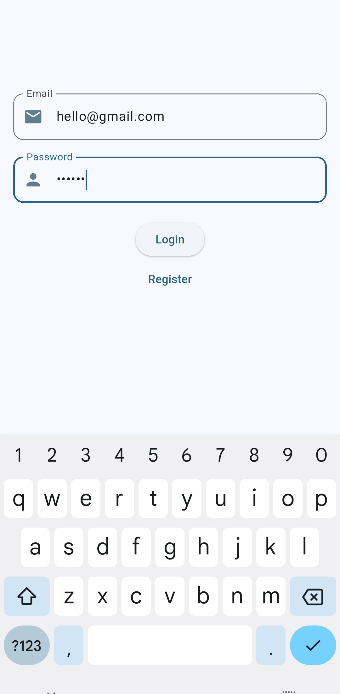
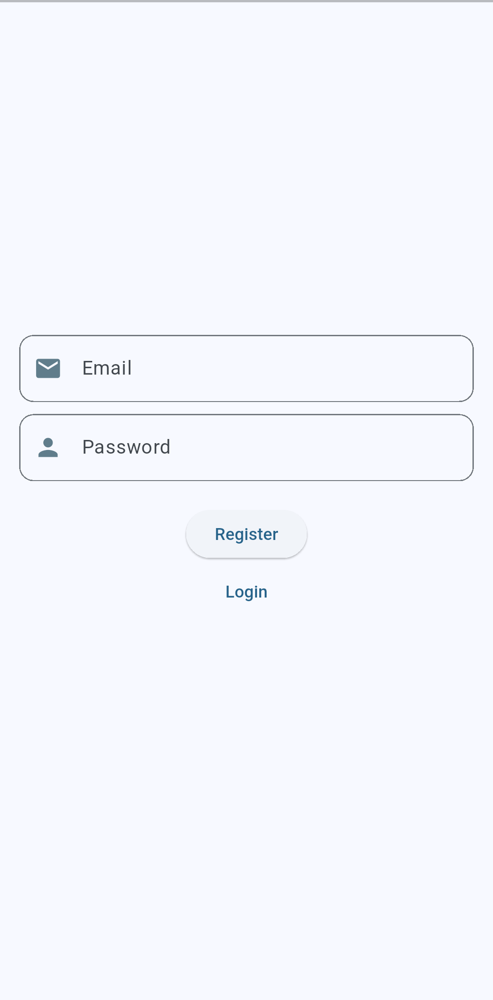
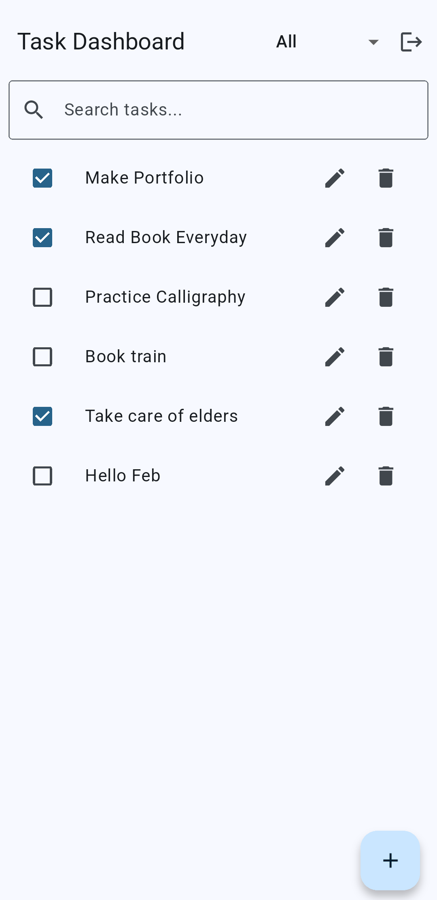
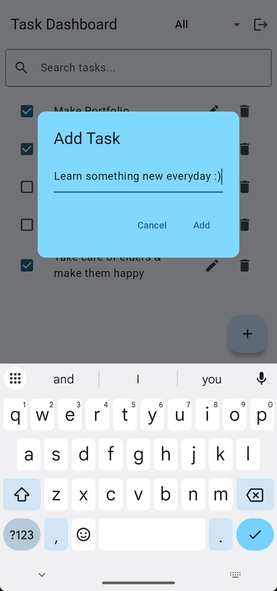
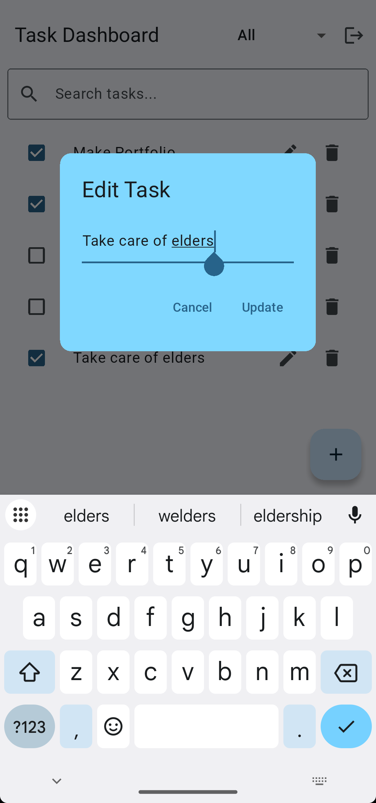
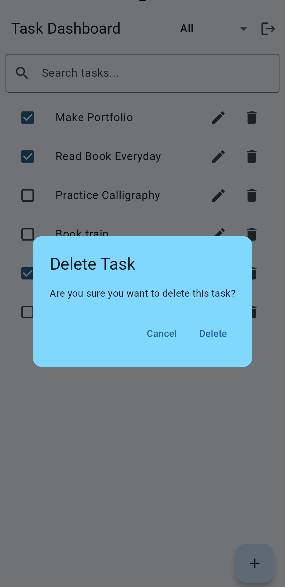
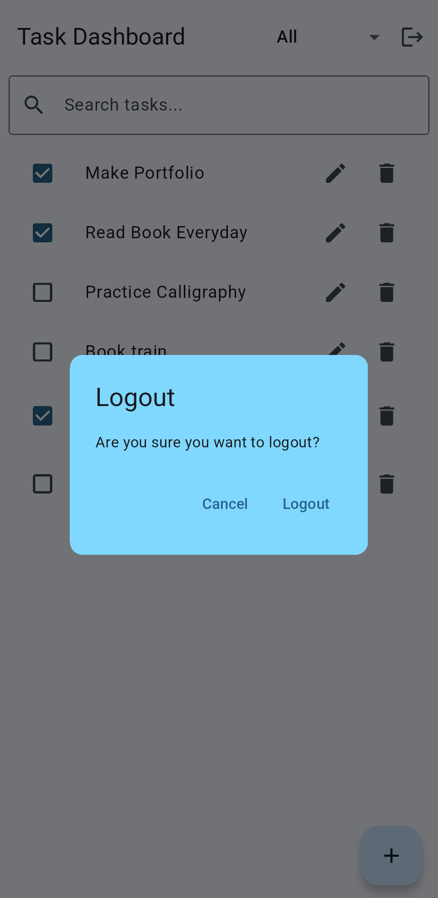

# Task Management System

This repository contains a complete Task Management System built as part of a software engineering assessment.

The project includes:
- Backend API built using Node.js, TypeScript, Prisma, and SQLite
- Mobile application built using Flutter (Android & iOS compatible)


## Features

- User Authentication (Register, Login, Logout)
- JWT-based Authentication (Access & Refresh Tokens)
- Secure password hashing using bcrypt
- Task CRUD operations (Create, Read, Update, Delete)
- Task status toggle (Completed / Pending)
- Pagination, filtering, and search
- Secure token storage on mobile
- Auto-login on app restart
- Logout functionality


## Tech Stack

### Backend
- Node.js
- TypeScript
- Express
- Prisma ORM
- SQLite
- JWT Authentication

### Mobile App
- Flutter
- Provider (MVVM Architecture)
- flutter_secure_storage
- Dio for API calls


## Project Structure

``` task-management-system/
├── backend/ # Node.js + TypeScript backend API
│ ├── src/
│ │ ├── controllers/ # Request handlers (Auth, Tasks)
│ │ ├── middleware/ # Authentication middleware
│ │ ├── routes/ # API route definitions
│ │ ├── prisma/ # Prisma client setup
│ │ └── server.ts # App entry point
│ ├── prisma/
│ │ ├── schema.prisma # Database schema
│ │ └── migrations/ # Database migrations
│ ├── package.json
│ └── README.md # Backend documentation
│
├── mobile/ # Flutter mobile application
│ ├── lib/
│ │ ├── auth/ # Login, Register, Auth Gate
│ │ ├── tasks/ # Task dashboard, CRUD UI
│ │ ├── core/ # Network, storage, widgets
│ │ └── main.dart # App entry point
│ ├── android/ # Android-specific files
│ ├── pubspec.yaml
│ └── README.md # Mobile app documentation
│
└── README.md # Root project documentation ```


## Screenshots

### Login Screen & Register Screen






### Dashboard Screen



### Add Operation



### Edit Operation



## Delete Operation




### Toggle Operation

## Pending Task 


## Completed Task


### Logout Operation



## How to Run the Project

Please refer to the individual README files for setup instructions:

- Backend setup: `backend/README.md`
- Mobile app setup: `mobile/README.md`


## API Configuration

The mobile application connects to a locally running backend server.

- Android Emulator uses: `http://10.0.2.2:3000`

To run the app on a real Android device, rebuild the APK with:

```bash
flutter build apk --release --dart-define=API_URL=http://<your-local-ip>:3000
